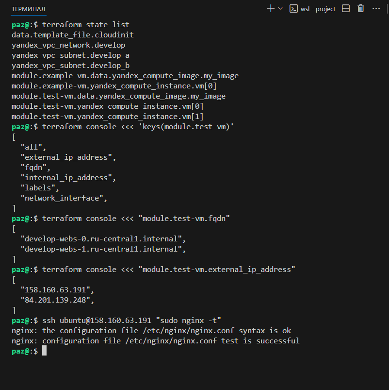
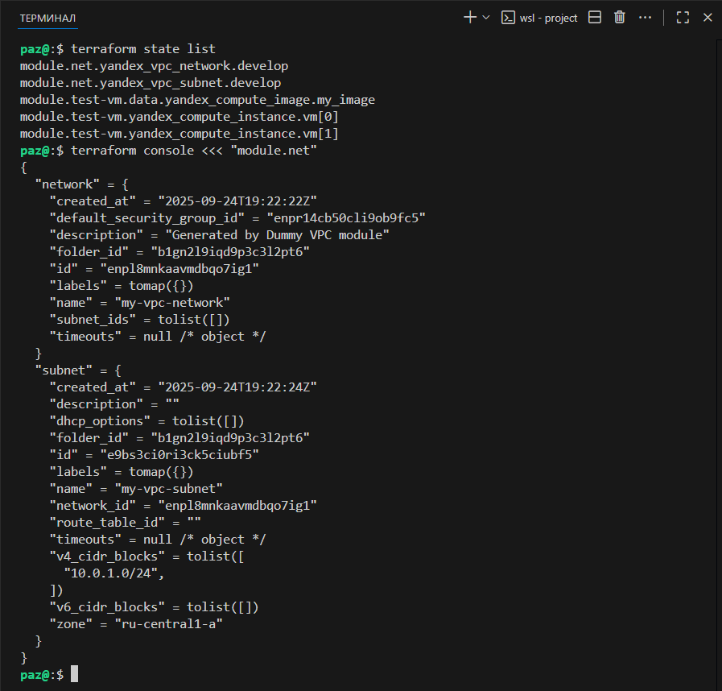
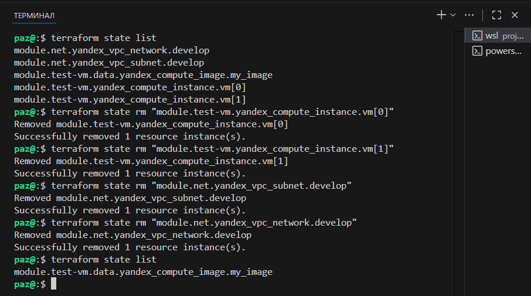
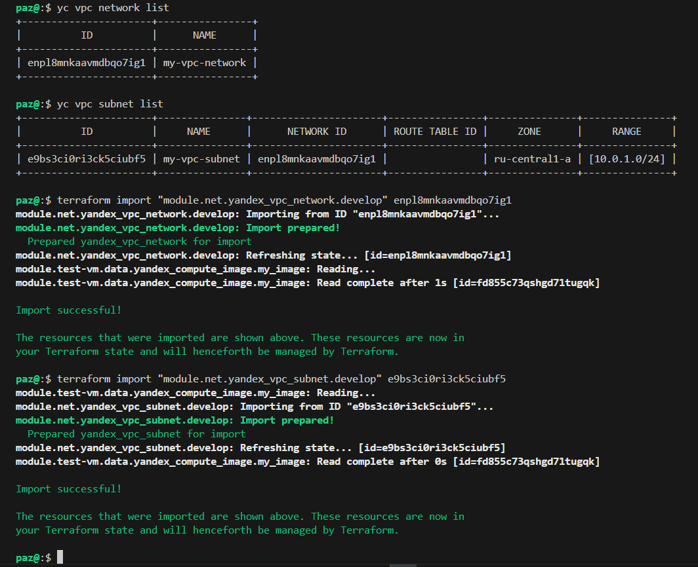
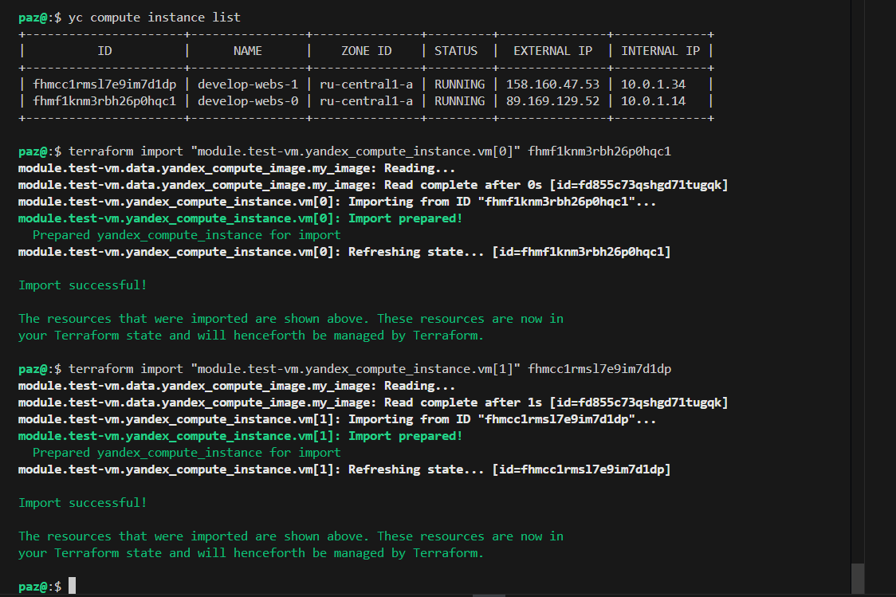
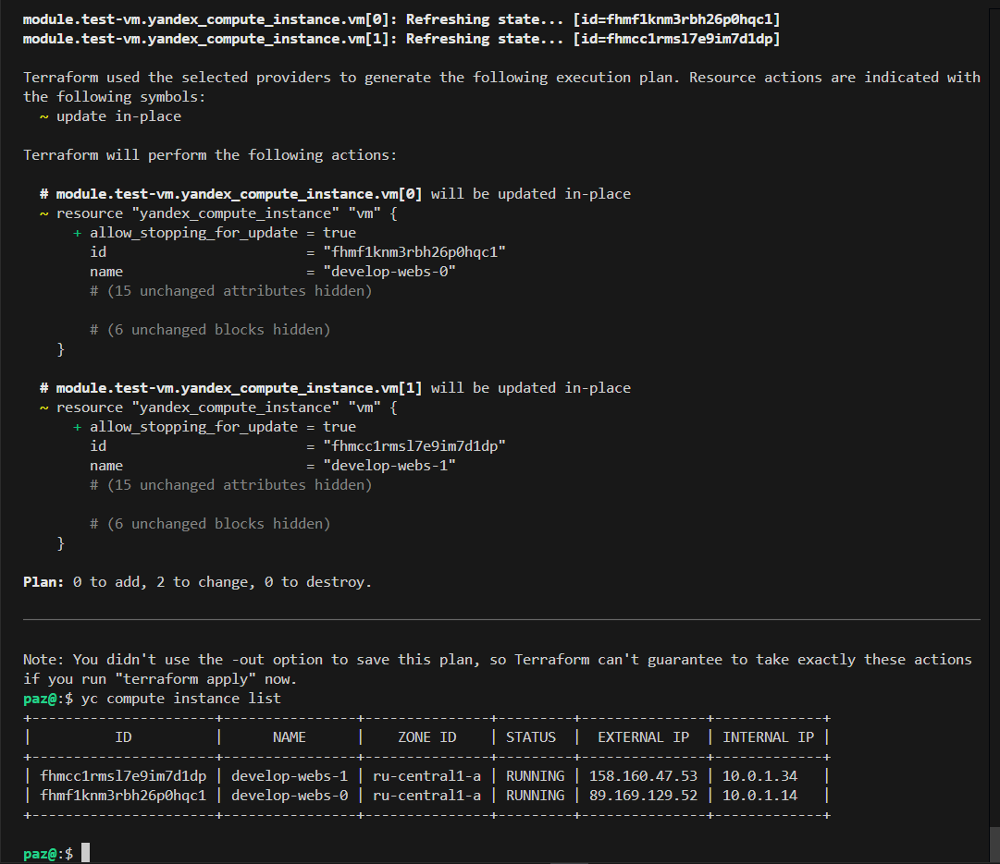
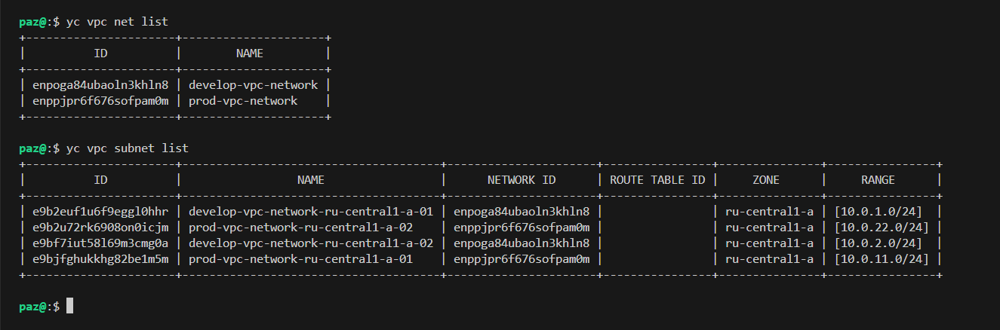

# Домашнее задание к занятию «Продвинутые методы работы с Terraform»

### Цели задания

1. Научиться использовать модули.
2. Отработать операции state.
3. Закрепить пройденный материал.


### Чек-лист готовности к домашнему заданию

1. Зарегистрирован аккаунт в Yandex Cloud. Использован промокод на грант.
2. Установлен инструмент Yandex CLI.
3. Исходный код для выполнения задания расположен в директории [**04/src**](https://github.com/netology-code/ter-homeworks/tree/main/04/src).
4. Любые ВМ, использованные при выполнении задания, должны быть прерываемыми, для экономии средств.

------
### Внимание!! Обязательно предоставляем на проверку получившийся код в виде ссылки на ваш github-репозиторий!
Убедитесь что ваша версия **Terraform** ~>1.8.4
Пишем красивый код, хардкод значения не допустимы!
------

### Задание 1

1. Возьмите из [демонстрации к лекции готовый код](https://github.com/netology-code/ter-homeworks/tree/main/04/demonstration1) для создания с помощью двух вызовов remote-модуля -> двух ВМ, относящихся к разным проектам(marketing и analytics) используйте labels для обозначения принадлежности.  В файле cloud-init.yml необходимо использовать переменную для ssh-ключа вместо хардкода. Передайте ssh-ключ в функцию template_file в блоке vars ={} .
Воспользуйтесь [**примером**](https://grantorchard.com/dynamic-cloudinit-content-with-terraform-file-templates/). Обратите внимание, что ssh-authorized-keys принимает в себя список, а не строку.
3. Добавьте в файл cloud-init.yml установку nginx.
4. Предоставьте скриншот подключения к консоли и вывод команды ```sudo nginx -t```, скриншот консоли ВМ yandex cloud с их метками. Откройте terraform console и предоставьте скриншот содержимого модуля. Пример: > module.marketing_vm
------
В случае использования MacOS вы получите ошибку "Incompatible provider version". В этом случае скачайте remote модуль локально и поправьте в нем версию template провайдера на более старую.
------

### Задание 2

1. Напишите локальный модуль vpc, который будет создавать 2 ресурса: **одну** сеть и **одну** подсеть в зоне, объявленной при вызове модуля, например: ```ru-central1-a```.
2. Вы должны передать в модуль переменные с названием сети, zone и v4_cidr_blocks.
3. Модуль должен возвращать в root module с помощью output информацию о yandex_vpc_subnet. Пришлите скриншот информации из terraform console о своем модуле. Пример: > module.vpc_dev  
4. Замените ресурсы yandex_vpc_network и yandex_vpc_subnet созданным модулем. Не забудьте передать необходимые параметры сети из модуля vpc в модуль с виртуальной машиной.
5. Сгенерируйте документацию к модулю с помощью terraform-docs.
 
Пример вызова

```
module "vpc_dev" {
  source       = "./vpc"
  env_name     = "develop"
  zone = "ru-central1-a"
  cidr = "10.0.1.0/24"
}
```

### Задание 3
1. Выведите список ресурсов в стейте.
2. Полностью удалите из стейта модуль vpc.
3. Полностью удалите из стейта модуль vm.
4. Импортируйте всё обратно. Проверьте terraform plan. Значимых(!!) изменений быть не должно.
Приложите список выполненных команд и скриншоты процессы.

## Дополнительные задания (со звёздочкой*)

**Настоятельно рекомендуем выполнять все задания со звёздочкой.**   Они помогут глубже разобраться в материале.   
Задания со звёздочкой дополнительные, не обязательные к выполнению и никак не повлияют на получение вами зачёта по этому домашнему заданию. 


### Задание 4*

1. Измените модуль vpc так, чтобы он мог создать подсети во всех зонах доступности, переданных в переменной типа list(object) при вызове модуля.  
  
Пример вызова
```
module "vpc_prod" {
  source       = "./vpc"
  env_name     = "production"
  subnets = [
    { zone = "ru-central1-a", cidr = "10.0.1.0/24" },
    { zone = "ru-central1-b", cidr = "10.0.2.0/24" },
    { zone = "ru-central1-c", cidr = "10.0.3.0/24" },
  ]
}

module "vpc_dev" {
  source       = "./vpc"
  env_name     = "develop"
  subnets = [
    { zone = "ru-central1-a", cidr = "10.0.1.0/24" },
  ]
}
```

Предоставьте код, план выполнения, результат из консоли YC.

### Задание 5*

1. Напишите модуль для создания кластера managed БД Mysql в Yandex Cloud с одним или несколькими(2 по умолчанию) хостами в зависимости от переменной HA=true или HA=false. Используйте ресурс yandex_mdb_mysql_cluster: передайте имя кластера и id сети.
2. Напишите модуль для создания базы данных и пользователя в уже существующем кластере managed БД Mysql. Используйте ресурсы yandex_mdb_mysql_database и yandex_mdb_mysql_user: передайте имя базы данных, имя пользователя и id кластера при вызове модуля.
3. Используя оба модуля, создайте кластер example из одного хоста, а затем добавьте в него БД test и пользователя app. Затем измените переменную и превратите сингл хост в кластер из 2-х серверов.
4. Предоставьте план выполнения и по возможности результат. Сразу же удаляйте созданные ресурсы, так как кластер может стоить очень дорого. Используйте минимальную конфигурацию.

### Задание 6*
1. Используя готовый yandex cloud terraform module и пример его вызова(examples/simple-bucket): https://github.com/terraform-yc-modules/terraform-yc-s3 .
Создайте и не удаляйте для себя s3 бакет размером 1 ГБ(это бесплатно), он пригодится вам в ДЗ к 5 лекции.

### Задание 7*

1. Разверните у себя локально vault, используя docker-compose.yml в проекте.
2. Для входа в web-интерфейс и авторизации terraform в vault используйте токен "education".
3. Создайте новый секрет по пути http://127.0.0.1:8200/ui/vault/secrets/secret/create
Path: example  
secret data key: test 
secret data value: congrats!  
4. Считайте этот секрет с помощью terraform и выведите его в output по примеру:
```
provider "vault" {
 address = "http://<IP_ADDRESS>:<PORT_NUMBER>"
 skip_tls_verify = true
 token = "education"
}
data "vault_generic_secret" "vault_example"{
 path = "secret/example"
}

output "vault_example" {
 value = "${nonsensitive(data.vault_generic_secret.vault_example.data)}"
} 

Можно обратиться не к словарю, а конкретному ключу:
terraform console: >nonsensitive(data.vault_generic_secret.vault_example.data.<имя ключа в секрете>)
```
5. Попробуйте самостоятельно разобраться в документации и записать новый секрет в vault с помощью terraform. 

### Задание 8*
Попробуйте самостоятельно разобраться в документаци и с помощью terraform remote state разделить root модуль на два отдельных root-модуля: создание VPC , создание ВМ . 

### Правила приёма работы

В своём git-репозитории создайте новую ветку terraform-04, закоммитьте в эту ветку свой финальный код проекта. Ответы на задания и необходимые скриншоты оформите в md-файле в ветке terraform-04.

В качестве результата прикрепите ссылку на ветку terraform-04 в вашем репозитории.

**Важно.** Удалите все созданные ресурсы.

### Критерии оценки

Зачёт ставится, если:

* выполнены все задания,
* ответы даны в развёрнутой форме,
* приложены соответствующие скриншоты и файлы проекта,
* в выполненных заданиях нет противоречий и нарушения логики.

На доработку работу отправят, если:

* задание выполнено частично или не выполнено вообще,
* в логике выполнения заданий есть противоречия и существенные недостатки. 


## Решение 


### Задание 1

Очень понравилась инициализация labels иcпользуя [for](https://developer.hashicorp.com/terraform/language/expressions/for). В моём варианте это выглядит так:

```hcl
  labels = { 
    for k,v in var.labels_owner: k => v
  }
```
Очень красиво можно инициализировать структуры. Нравится.

С переменной содержащей ssh ключи вышло не трудно, в предыдущей части мучали шаблоны сильнее, поэтому, как закрепление материала, нормально.

По поводу установки **nginx**. После добавления строчки в шаблон и запуска terraform apply наши ВМ были изменены, то есть, terraform увидел изменения и никакие depends on не нужно прописывать. Но, есть одно но!

Теперь нам удалить ресурс, а потом создать снова. 
Вот так смотрим все созданные ресурсы: 
```bash 
terraform state list 
```
удаляем нужный ресурс из tfstate: 
```bash 
terraform state rm 'module.test-vm.yandex_compute_instance.vm[0]' 
``` 
ну и удаляем нужный ресурс из самого облака.

Версия для трусов: 
```bash  
terraform apply --destroy --target="module.test-vm.yandex_compute_instance.vm"  
```
После чего создаём ресурсы снова.
```bash  
terraform apply --target="module.test-vm.yandex_compute_instance.vm"  
```

Может возникнуть вопрос, а почему пересоздаём? Ответ прост, наш cloud_init как понятно из имени файла, выполняется только при инициалзации, читай первом запуске, ВМ. 

Вот скриншот работы проекта из первого задания. Постарался уместить всю информацию на один скриншот.



### Задание 2

Из интересного, это то, что у модуля нет отдельного файла для входных переменных, по примеру output данных.

Что важно, для **обязательных** переменных не нужно делать default значения. 
Для проверки вводимых значений must have блоки **validation**

Вот так оно работает.


terraform-docs оказалось проще установить используя snap. 
Команда для создания описания выглядит тривиально:
```bash
terraform-docs markdown table . 
```
Но, судя по хелпу к ней, это серьёзная штука. 


### Задание 3


Список ресурсов до удаления
```bash 
terraform state list 
```

Само удаление
```bash 
terraform state rm "module.test-vm.yandex_compute_instance.vm[0]"
```

Список ресурсов после удаления
```bash 
terraform state list 
```




Дальше будет много скриншотов.

Добавляем сеть и подсеть. Можно было наковырять однострочник, и наверное было бы неплохо и даже правильно, например используя template, такой создать. Чтобы запустив sh скрипт можно было верифицировать наш state файл и если нужно - восстановить. Хотя эта штука настолько очевидна, что, полагаю, должна быть от провайдера.


Добавляю ВМ


И вот что выплюнул ``` terraform plan ```:


На самом деле меня смутило то, что стоял плюсик в этой строке ```+ allow_stopping_for_update = true ```. Я ожидал, что terraform будет перезагружать ВМ, хотя id и name он указал ровно те же самые, на скриншоте видно!. В итоге я не струсил и запустил ``` terraform apply ``` и.... terrform не перезагружал ВМ (специально повторил и смотрел по логам). В общем, я бы переживал немного, еслиб это был прод и я не знал о таком приколе.

Сделать import с кривым id не даст, сравнивает с тем, что отдаёт провайдер.

Дважды import одного и того же ресурся тоже не хочет делать. В общем, есть некая защита от дурака.


### Задание 4*

Пришлось изменить исходный код модуля из второго задания. Вот он:
[Исходный код](./task2/main.tf)

Сам [План](./task2/plan.log) выполнения terraform




### Задание 5*


### Задание 6*

Алгоритм действия:

- Скачал модуль себе (хотя можно было просто указать в source путь на git)
- Скопировал код из example к себе и немного изенил его (поменял путь к модулю и максимальный размер хранилища)
- Докинул ключей для аторизации в Яндексе
- ``` terraform init ``` ``` terraform validate ``` ``` terraform plan ``` ``` terraform apply ```
- Профит


### Задание 7*

Устанавливается terraform vault через apt, есть вариант дёрнуть docker с ним, но мне показалось так проще.

Первое знакомство как-то не впечатлило. Поковырялся в истории вопроса. Выяснилось, что из-за развития микросервисов и "уплотнения" инфраструктуры, встал вопрос автоматизации процесса авторизации и расширения функционала. Хранить не только пароли но и секреты. При этом авторизация выделяется как отдельный слой: OPA, Zero Trust Network Access (ZTNA) SPIFFE/SPIRE, Istio. Как итог, вместо LDAP имеем  OIDC + короткоживущие токены.

Цены на этот Vault конечно...

Не знаю почему, но документация по провайдеру очень скудная. Вот [что нашёл](https://developer.hashicorp.com/vault/tutorials/get-started/learn-terraform#auth-method-resource) на офф сайте, плюс какой-то howto на просторах интернета. Есть достаточно много документации как с ним работать из CLI, по крайней мере логика работы и необходимые параметры будет ясна.

В целом задача простая, вся работа идёт через **vault_generic_secret**. Через него и читаем и пишем, просто объявляя разные ресурсы


### Задание 8*


Чтобы сделать разделяемый state файл, его лучше поместить в s3 bucket. Но, тут встаёт вопрос о курице и яйце, я руками должен создать bucket в облаке, так как у меня не получится с помощью terraform создать bucket на стороне провайдера для которого я потом разворачиваю всякие vpc и ВМ. Ну или мини bootstrap проект, который будет разворачивать необходимую инфраструктуру.


Вот [тут](https://yandex.cloud/ru/docs/tutorials/infrastructure-management/terraform-state-storage#set-up-backend) неплохо расписано то что будем дальше делать. 

Для работы с s3 bucket понадобится [**Статические ключи доступа, совместимые с AWS API**](https://yandex.cloud/ru/docs/iam/concepts/authorization/access-key) хотя в офф документации взятой [тут](https://yandex.cloud/ru/docs/tutorials/infrastructure-management/terraform-state-storage#bash_1) говорится по тексту буквально так: **Добавьте в переменные окружения идентификатор ключа и секретный ключ**, и только в самом начале статьи пишут о статическом ключе доступа. Я на этом сильно затупил. Mea culpa, знание о роли различных типах ключей или чуть более внимательное прочтение избавило бы от часов гугления и вычитывания статей.

Когда речь идёт о "разделяемом" файле, то это не занчит что он общий, это значит, что есть возможность прочитать из него outputs значения и использовать в своём проекте. То есть у каждого проекта остаётся свой state файл.

